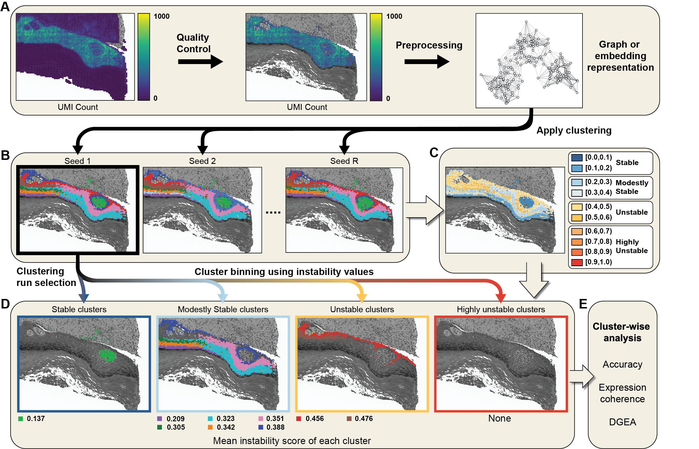

# InSTability

`InSTability` quantifies spot-level clustering instability across repeated
spatial transcriptomics clustering runs. This repository provides two examples
using Leiden clustering on human dorsolateral prefrontal cortex (DLPFC)
samples 151671 and 151673.

## Overview

`InSTability` repeatedly clusters the same spatial transcriptomics sample and
uses the resulting partitions to measure how consistently each spot is grouped
with other spots. Higher scores indicate that a spot's cluster membership is
less stable across runs.

## Installation

To install the dependencies, we recommend using Conda:

```bash
conda env create -f environment.yml
conda activate spatialplot
export SSL_CERT_FILE=$(python -c "import certifi; print(certifi.where())")
```

The environment can be verified with:

```bash
python - <<'PY'
import spatialdata
import spatialdata_plot
import scanpy

print("spatialdata:", spatialdata.__version__)
print("spatialdata-plot:", spatialdata_plot.__version__)
print("scanpy:", scanpy.__version__)
print("success")
PY
```

Installation should take a few minutes on a typical workstation.

## Example

The complete analysis can be run from the repository root:

```bash
# Download and prepare DLPFC samples 151671 and 151673
python scripts/prepare_data.py

# Generate repeated Leiden partitions
python scripts/run_leiden.py

# Calculate InSTability
python scripts/calculate_uncertainty.py

# Create the Figure 2-style panel for each sample
python scripts/plot.py
```

By default, `InSTability` uses **20 clustering runs**, with random seeds 42
through 61.

To use a different number of runs, pass the same value to all three analysis
commands. For example, to use 50 runs:

```bash
python scripts/run_leiden.py --iterations 50
python scripts/calculate_uncertainty.py --run-counts 50 --max-iterations 50
python scripts/plot.py --iterations 50
```

Multiple run counts may be calculated from one set of saved partitions:

```bash
python scripts/calculate_uncertainty.py \
    --run-counts 10 20 30 40 50 \
    --max-iterations 50
```

## Example datasets

The examples use DLPFC samples 151671 and 151673. The original `.h5ad` files
are downloaded from
[han-shu/st_datasets](https://huggingface.co/datasets/han-shu/st_datasets/tree/main/DLPFC).
The corresponding `151671_truth.txt` and `151673_truth.txt` layer-annotation
files are downloaded individually from the
[ST data for ADEPT Zenodo record](https://zenodo.org/records/7591162).
Annotations are joined to the expression data by spot barcode and stored in
`adata.obs["annotation"]`. Spots without a manual layer label remain missing.

The preprocessing retains spots with at least 600 UMIs, retains genes detected
in at least 20 spots, removes mitochondrial genes, and removes spots with at
least 25% mitochondrial counts.

## Notes

- Leiden is run using 3,000 highly variable genes, 50 principal components,
  and 50 nearest neighbors.
- The requested cluster counts are five for sample 151671 and seven for sample
  151673.
- Figure plot is saved separately for each sample as
  `figures/dlpfc_151671.{png,pdf}` and
  `figures/dlpfc_151673.{png,pdf}`.
- Each Figure panel contains the example Leiden partition, spotwise
  InSTability, clusterwise InSTability, and reference labels. All spatial
  panels use `spatialdata-plot` with the same hexagonal geometry, grayscale
  histology, threshold colors, and grouped legend as the manuscript plotting
  code.
- `scripts/functions.py` contains the required preprocessing helpers.
- `scripts/spot_removal.py` contains an optional DBSCAN-based helper. It is not
  applied to the two DLPFC examples.
- Large `.h5ad`, `.pkl`, and generated result files are excluded from Git.
